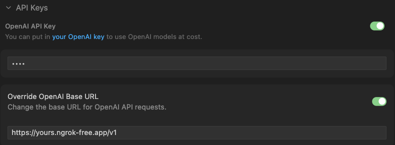

# LLMSter + Cursor

This note outlines the process for integrating Cursor with a locally hosted language model via LLMSter. Configuration steps are provided to set up Cursor to interact with a local LLM instance through the LLMSter API. This enables private, high-performance code assistance in the editor with open source or custom models.

# Step 1: LLMSter Configuration

To begin, download a desired model and load it using LLMSter:

```bash
lms load openai/gpt-oss-20b
```

Next, launch the LLMSter server:

```bash
lms server start
```

# Step 2: Ngrok Configuration

To make the local LLMSter API accessible remotely, install and set up Ngrok:

```bash
curl -sSL https://ngrok-agent.s3.amazonaws.com/ngrok.asc \
  | sudo tee /etc/apt/trusted.gpg.d/ngrok.asc >/dev/null \
  && echo "deb https://ngrok-agent.s3.amazonaws.com bookworm main" \
  | sudo tee /etc/apt/sources.list.d/ngrok.list \
  && sudo apt update \
  && sudo apt install ngrok
```

Register an Ngrok authtoken:

```bash
ngrok config add-authtoken <token>
```

Create an Ngrok tunnel to the local LLMSter server endpoint:

```bash
ngrok http http://localhost:1234/
```

Ngrok will generate a public URL similar to:

```bash
https://yours.ngrok-free.app
```
This URL is required for integration in Cursor.

# Step 3: Cursor Configuration

Within Cursor, navigate to Settings → Models / OpenAI Configuration and update the following fields:

1. Enable OpenAI API Key.  
2. Input any value as the API key (e.g., `1234`).  
3. Paste the Ngrok public URL into the "Override OpenAI Base URL" field.  
4. Add `/v1` to the end of the URL.  



# Step 4: Usage

Open Cursor Chat, enter a prompt, and submit it. Cursor will route requests through Ngrok to the local LLM hosted by LLMSter. This workflow provides access to Cursor’s coding features while maintaining local inference and data privacy.

# References

- [LLMSter](https://lmstudio.ai/docs/developer/core/llmster)
- [Ngrok](https://ngrok.com/)
- [Cursor](https://www.cursor.com/)
- [Use Cursor with Local LLM and LM Studio](https://dev.to/0xkoji/use-cursor-with-local-llm-and-lm-studio-i54)