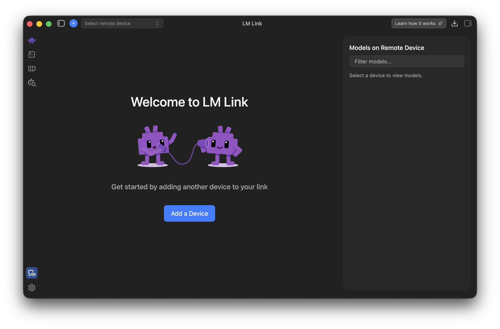
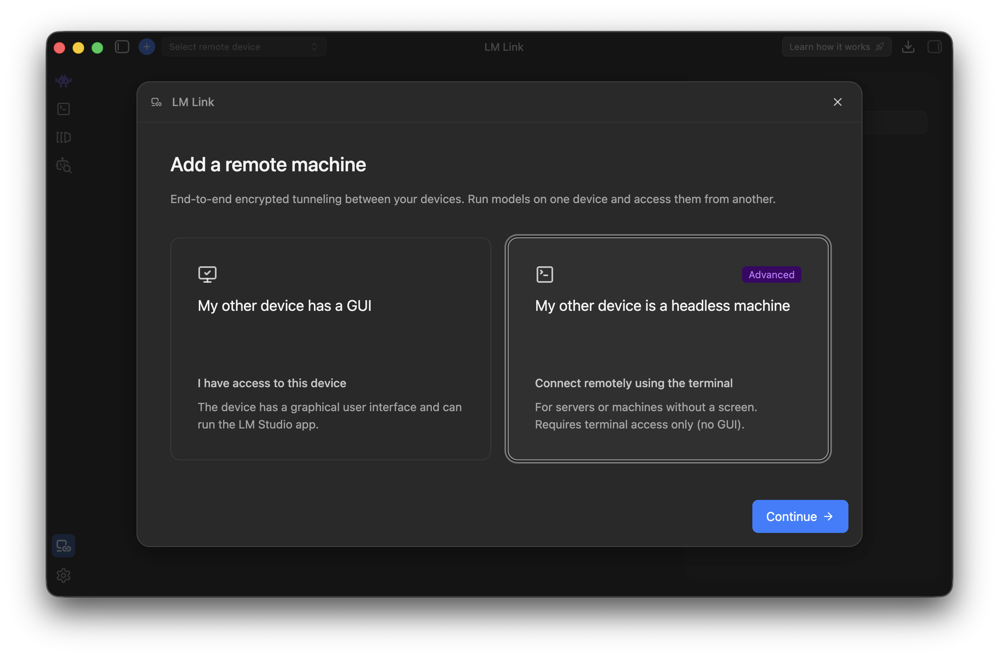
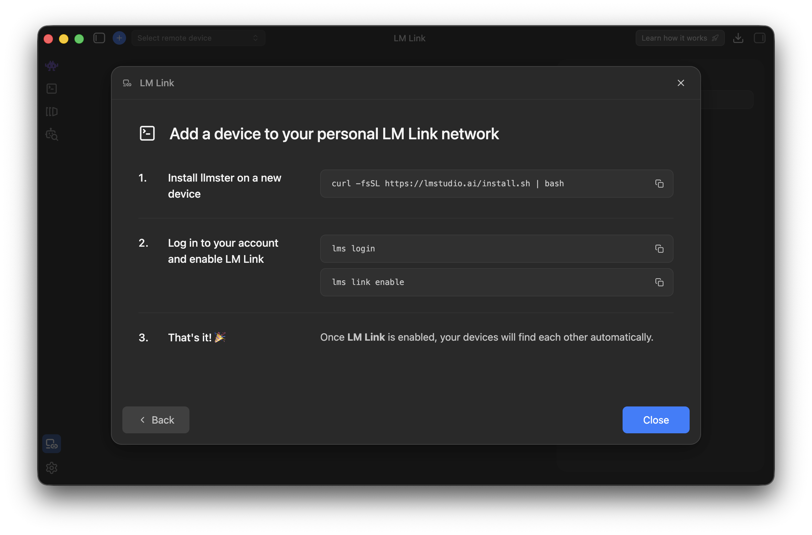
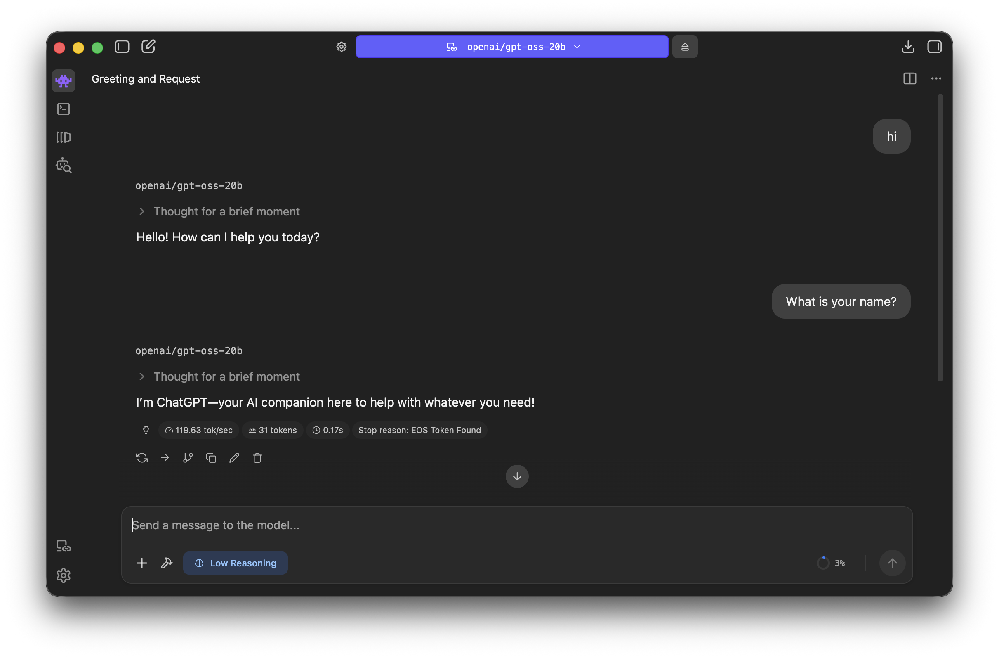

# Using LLMSter with LM Studio via LM Link

This note outlines the process for connecting LM Studio and LLMSter using LM Link. The configuration steps describe bridging LM Studio with a locally hosted LLMSter API through LM Link, enabling private, high-performance code assistance within the editor using open source or custom language models.

# Step 1: Prepare LLMSter (LM Studio Headless)

To begin, download a desired model and load it using LLMSter:

```bash
lms load openai/gpt-oss-20b
```

Next, launch the LLMSter server:

```bash
lms server start
```

> *Tip:* You can verify the local API with:
> ```bash
> curl http://localhost:1234/v1/models
> ```

# Step 2: Connect LM Studio via LM Link

LM Link is LM Studio’s feature for connecting to external OpenAI-compatible APIs.

1. Open **LM Studio** (the desktop app, not headless).
2. Go to **Settings → Link**.
3. Click **Add a Device**.  

  

4. Select **My other device is a headless machine** and click **Continue**.  



5. Follow the instructions and execute commands on LLMSter machine. 

> *Tip:*
> Can skip no 1, if already have a LLMSter server running.  



LM Studio will now display your local model (e.g., `openai/gpt-oss-20b`) as an available provider. Now, can chat/call completions using the LLMSter backend directly in LM Studio’s interface.

# Step 3: Usage

LLMSter and LM Studio can run on the same machine, other machines on local or remote network using LM Link.



# Reference

[LM Link documentation](https://lmstudio.ai/link#lm-link-how-it-works)