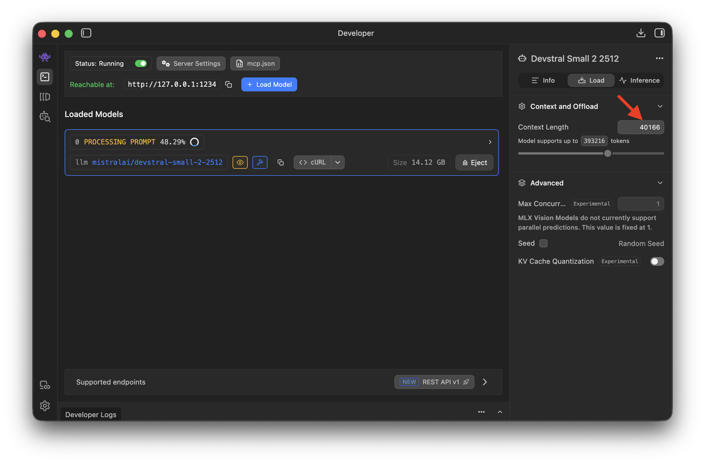

# Using LLMSter with OpenCode

This note outlines the process for integrating OpenCode with a locally hosted language model via LLMSter. Configuration steps are provided to set up OpenCode to interact with a local LLM instance through the LLMSter API. This enables private, high-performance code assistance in the editor with open source or custom models.

# Step 1: LLMSter Configuration

To begin, download a desired model and load it using LLMSter:

```bash
lms load devstral/small-2-2512
```

Next, launch the LLMSter server:
```bash
lms server start
```

Using LM Studio, asign `Context Length` lager than 20000.



> *Tip:* You can verify the local API with:
> ```bash
> curl http://localhost:1234/v1/models
> ```

# Step 2: OpenCode Configuration

Edit the `~/.config/opencode/opencode.json` file to add your preferred models.

```bash
{
  "$schema": "https://opencode.ai/config.json",
  "provider": {
    "llmster-gemma-3-4b": {
      "npm": "@ai-sdk/openai-compatible",
      "options": { "baseURL": "http://localhost:1234/v1" },
      "models": {
        "google/gemma-3-4b": { "limit": { "context": 20000, "output": 4096 } }
      }
    },
    "llmster-devstral-small-2-2512": {
      "npm": "@ai-sdk/openai-compatible",
      "options": { "baseURL": "http://localhost:1234/v1" },
      "models": {
        "devstral/small-2-2512": { "limit": { "context": 20000, "output": 4096 } }
      }
    }
  }
}
```

# Step 3: Usage

Run the OpenCode agent in the terminal.

```bash
opencode
```
or
```bash
opencode -m llmster-gemma-3-4b/google/gemma-3-4b
```
or
```bash
opencode -m llmster-devstral-small-2-2512/devstral/small-2-2512
```

# References

[OpenCode](https://opencode.ai/)