# Network Traffic Classification Architecture

# ET-BERT

By: Xinjie Lin, Gang Xiong, Gaopeng Gou, Zhen Li, Junzheng Shi & Jing Yu  
Year: 2022  
DOI: [10.1145/3485447.3512217](https://doi.org/10.1145/3485447.3512217)  

ET-BERT is a method for learning datagram contextual relationships from encrypted traffic, which could be directly applied to different encrypted traffic scenarios and accurately identify classes of traffic. First, ET-BERT employs multi-layer attention in large scale unlabelled traffic to learn both inter-datagram contextual and inter-traffic transport relationships. Second, ET-BERT could be applied to a specific scenario to identify traffic types by fine-tuning the labeled encrypted traffic on a small scale.

## BERT
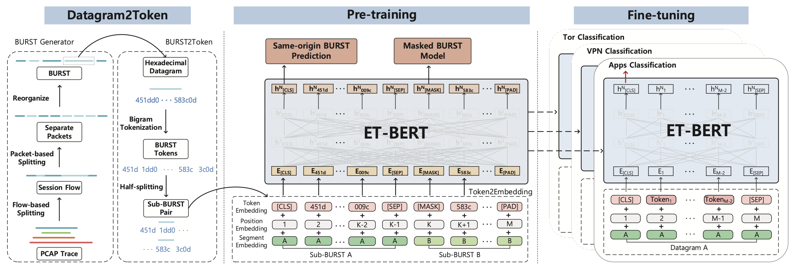

# Trident

By: Ziming Zhao, Zhaoxuan Li, Zhuoxue Song, Wenhao Li, Fan Zhang  
Year: 2024  
DOI: [10.1145/3589334.3645407](https://doi.org/10.1145/3589334.3645407)

Trident addresses two primary challenges in network traffic classification: (i) the detection of fine-grained, emerging attacks, and (ii) incremental updates and adaptations. To address these issues, the researchers reformulate the identification of known and new classes as multiple, independent one-class learning tasks, thereby decoupling model capabilities. Based on this approach, Trident is designed as a universal framework for fine-grained detection of unknown encrypted traffic. The framework includes three key modules: tSieve (for traffic profiling), tScissors (for determining outlier thresholds), and tMagnifier (for clustering), each with support for custom configurations. Experiments conducted on four widely-used network trace datasets indicate that Trident achieves significant performance improvements over 16 state-of-the-art (SOTA) methods. Further evaluations, such as concept drift handling and assessments of computational overhead and parameter efficiency, demonstrate the stability, scalability, and practicality of the Trident framework.

## AutoEncoder
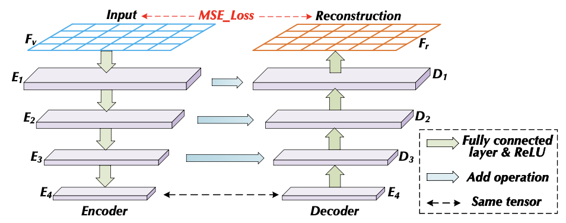

## RNN
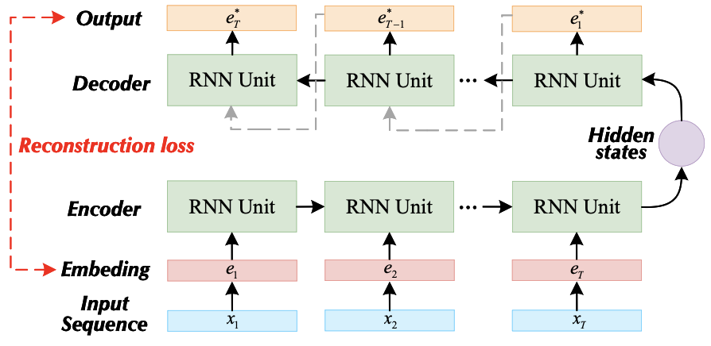

## GNN
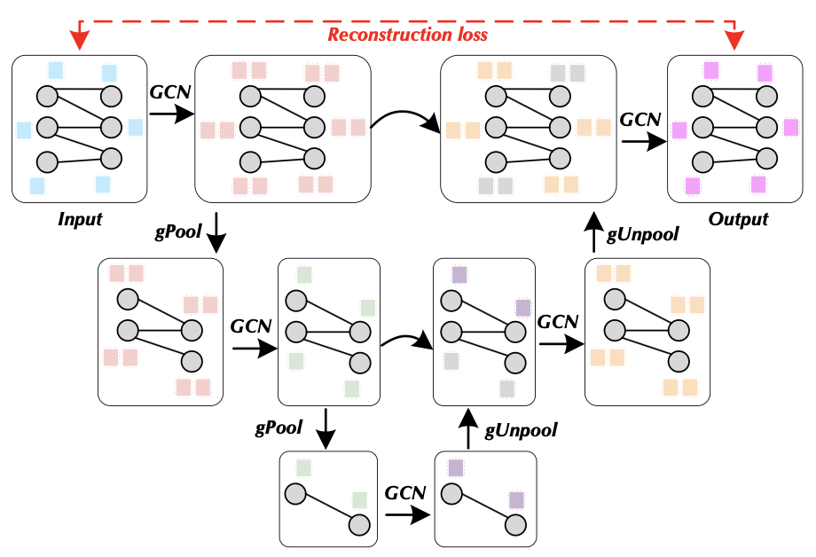

# MH-Net

By: Haozhen Zhang, Haodong Yue, Xi Xiao, Le Yu, Qing Li, Zhen Ling & Ye Zhang  
Year: 2023  
DOI: [10.48550/arXiv.2501.03279](https://doi.org/10.48550/arXiv.2501.03279)

MH-Net addresses the shortcomings of traditional byte-level analysis by introducing a novel classification approach that utilizes multi-view heterogeneous traffic graphs to represent detailed relationships among traffic bytes. MH-Net creates multiple types of traffic units by aggregating different numbers of bits, resulting in multi-view traffic graphs with varying levels of information granularity. By modeling various byte correlations—such as those between header and payload—MH-Net introduces heterogeneity to the traffic graph, which substantially boosts model performance. Additionally, it employs multi-task contrastive learning to reinforce the robustness of traffic unit representations. Experiments on the ISCX and CIC-IoT datasets, considering both packet-level and flow-level classification, demonstrate that MH-Net consistently outperforms numerous state-of-the-art methods.

## GNN + RNN
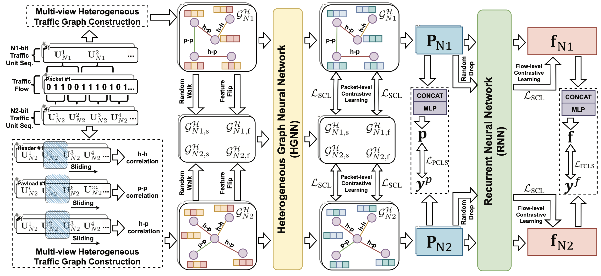

# LiteNet
LiteNet offers a comprehensive, end-to-end workflow for training, optimizing, and deploying neural network models for Network Traffic Classification (NTC). Its pipeline incorporates SHAP-based feature selection, semi-structured sparse pruning, quantization to FP16 or INT8, and conversion into a TensorRT engine to enable high-performance inference.

## CNN
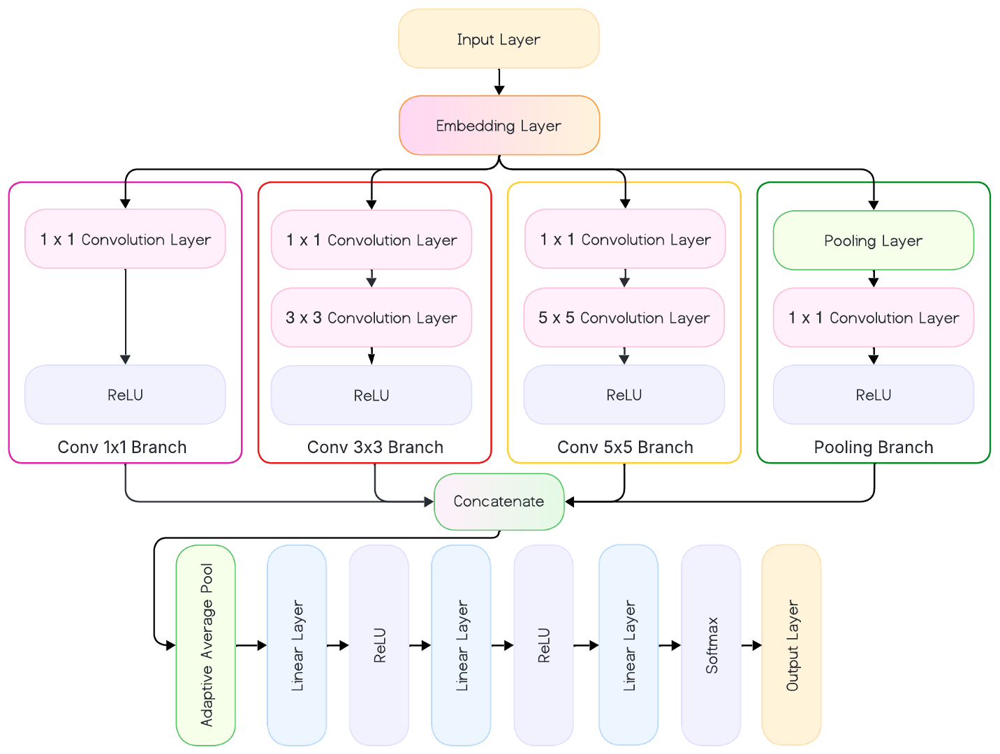

## Compression Techniques
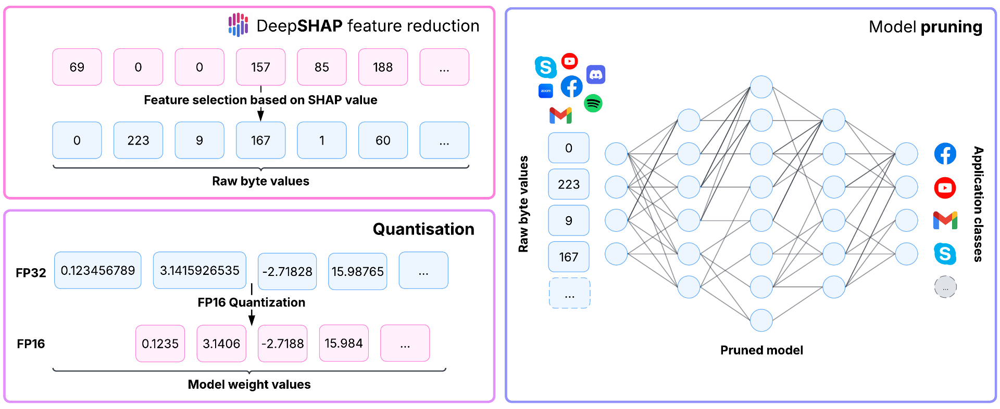

# MATEC
MATEC introduces a lightweight neural network that specifically focuses on time and space complexity to improve online performance and efficiency for encrypted traffic classification. The core innovation of MATEC lies in its use of three consecutive packets randomly chosen from within a traffic flow as its input, capturing critical contextual information. Feature representations at both the global (flow) and local (packet) levels are maximized for reuse through a streamlined, "thin" module design. Central to this architecture is the integration of multi-head attention mechanisms alongside 1D convolutional networks (1D-CNN), enabling MATEC to effectively model relationships within and between packets for highly efficient and accurate online encrypted traffic classification.

## Embedding and Attention Encoder Module
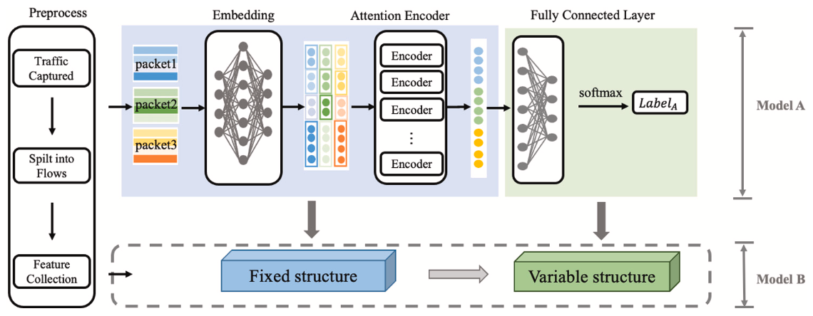

## Multi-head Attention Module
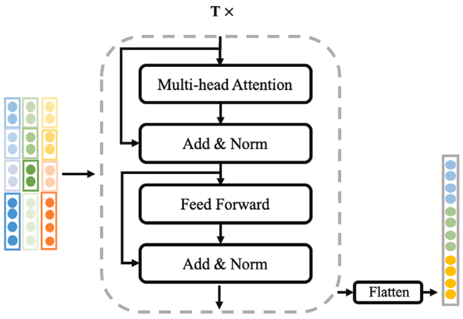

# TMC-GCN

By: Baoquan Liu, Xi Chen, Qingjun Yuan, Degang Li & Chunxiang Gu  
Year: 2024  
DOI: [10.32604/cmc.2024.059688](https://doi.org/10.32604/cmc.2024.059688)  

Traffic Mapping Classification-Graph Convolutional Networks model (TMC-GCN) is introduced to address encrypted traffic classification. The model is built upon a network traffic topology known as the Flow Mapping Graph (FMG), which leverages Graph Convolutional Networks (GCN). In FMG, sequential edges are created between vertices according to the arrival order of packets, while jump-order edges connect packets from different bursts that share the same direction. This design not only captures the temporal characteristics of the packets but also enhances the representation of relationships between client and server packets. Utilizing FMG, TMC-GCN is able to automatically capture and learn the features and structural information of key vertices. By transforming the encrypted stream classification problem into a graph classification task, TMC-GCN enables effective classification of encrypted traffic originating from various data sources and application scenarios.

## GCN

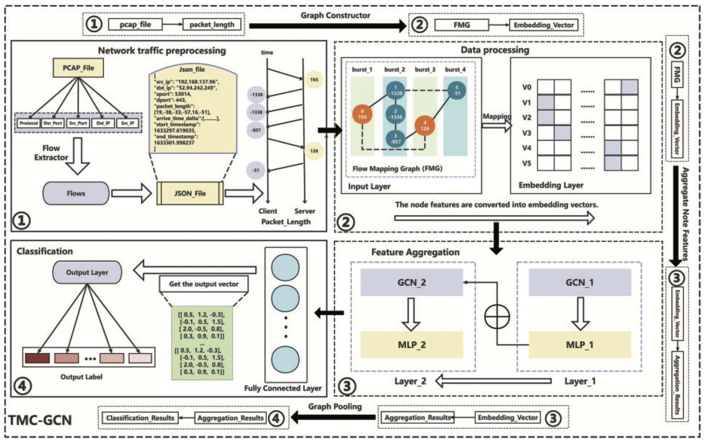

## Packet-Level Client-Server Interaction for a Stream

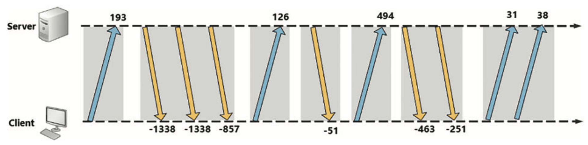

## FMG Construction Process for Encrypted Traffic

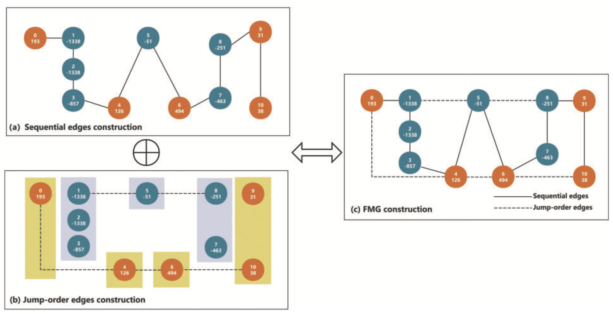

# ADGCN

By: Shengwei Xu, Jijie Han, Yilong Liu, Haoran Liu & Yijie Bai  
Year: 2025  
DOI: [10.1038/s41598-025-94240-6](https://doi.org/10.1038/s41598-025-94240-6)  

The autoencoder (AE) and deep graph convolutional networks (ADGCN) introduces a method for traffic classification on few-shot datasets. Researchers first employ an AE to reconstruct the traffic, allowing shorter traffic samples to learn abstract feature representations from longer traffic instances of the same class, effectively replacing zeros and mitigating the negative impact of zero-padding. The reconstructed traffic is subsequently classified using GCNII, a deep GCN architecture designed to address the challenge of limited data samples. As an end-to-end traffic classification approach suitable for various scenarios, ADGCN demonstrates, according to experimental results, a classification accuracy improvement of 3.5% to 24% compared to existing state-of-the-art methods.

## AE + GCN

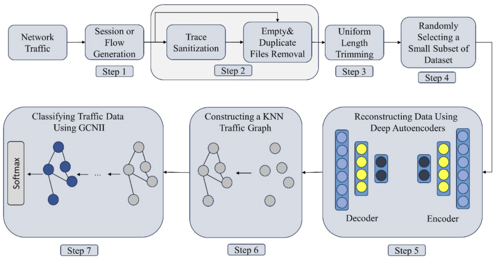