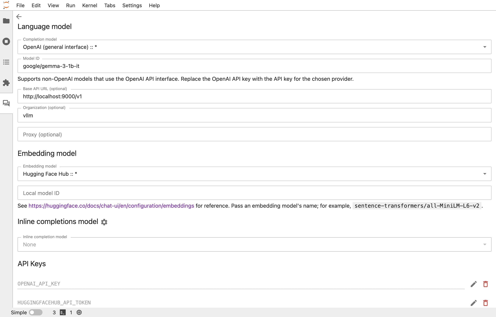
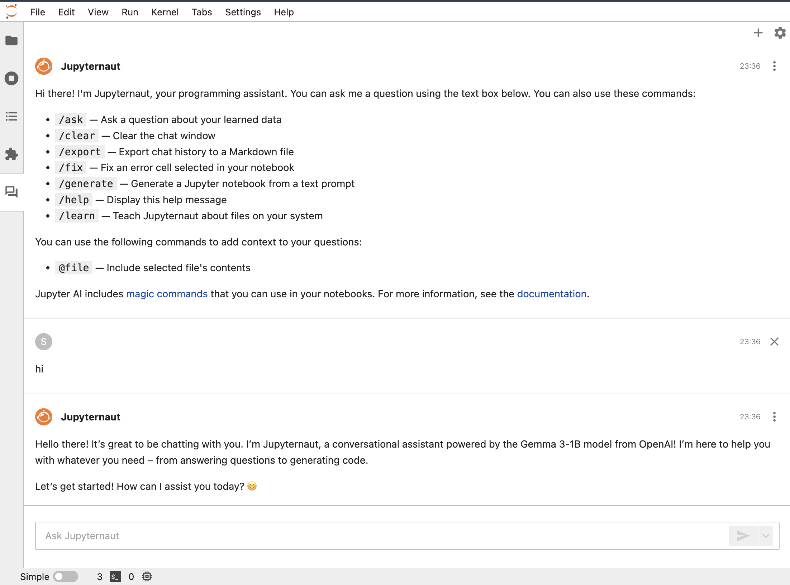

# vLLM in Jupyter AI Agent
Jupyter AI Agent extends JupyterLab and notebook environments with powerful generative AI functionality, making it easy to interact with large language models (LLMs) right inside your notebooks. Through Jupyter AI, you can chat with LLMs, generate and explain code, summarize content, and accelerate your workflow using AI—directly in your familiar interface.

By integrating **vLLM** as your backend, you can run cutting-edge models (like Gemma, Llama, or Qwen) locally on your GPU or CPU via an OpenAI-compatible API. This setup keeps your data private and ensures all AI processing happens on your own hardware, avoiding reliance on third-party cloud providers.

**How to connect vLLM with Jupyter AI Agent:**

1. **Start a vLLM server** on your local machine with your preferred model. (See instructions in the "Run vLLM" section below.)
2. **Point Jupyter AI to your local vLLM server** by configuring the provider endpoint (e.g., `http://localhost:9000/v1`) within Jupyter AI's settings.

Once set up, your notebooks can leverage any model you serve with vLLM for interactive chat, coding help, and content generation, all within your local environment and under your control.

# vLLM Installation
Please refer [here](https://github.com/superzerosec/100-day-challenge/blob/main/asset/vLLM_Ollama_OpenCode_Stack.md#install-vllm) for installation instructions.

## Run vLLM
In a terminal window, serve the Google Gemma 3 1B IT model on port 9000.
```bash
export CUDA_DEVICE_ORDER=PCI_BUS_ID
export CUDA_VISIBLE_DEVICES=0
uv run vllm serve google/gemma-3-1b-it \
  --port 9000 \
  --tensor-parallel-size 1 \
  --gpu-memory-utilization 0.8 \
  --max-model-len 20000 \
  --enable-auto-tool-choice \
  --tool-call-parser hermes \
  --trust-remote-code
```
# Jupyter AI Installation
In a terminal window, install Jupyter AI.
```bash
uv venv --python 3.13
```
Install Jupyter AI.
```bash
uv add jupyterlab "jupyter-ai[all]"
```
## Run Jupyter AI 
Generate a password for Jupyter AI.
```bash
uv run jupyter-server password
```
Run Jupyter AI.
```bash
uv run jupyter-lab --ip=0.0.0.0 --port=11111 --no-browser
```
Open the Jupyter Lab interface in your browser.
```bash
http://localhost:11111
```

## Configure Jupyter AI to use vLLM
1. Click on the "Settings" icon in the top right corner of the Jupyter AI interface.
2. Completion model `openai-chat-custom:*`
3. Model ID `google/gemma-3-1b-it`
4. Embedding model `huggingface_hub:*`
5. API Keys random key



## Chat using vLLM (Local) in Jupyter AI
1. Interact with the assistant directly in the “AI Chat” panel.
2. Enter your prompt in the input field.
3. Click on the "Send" button.
4. The response will be displayed in the output field.


